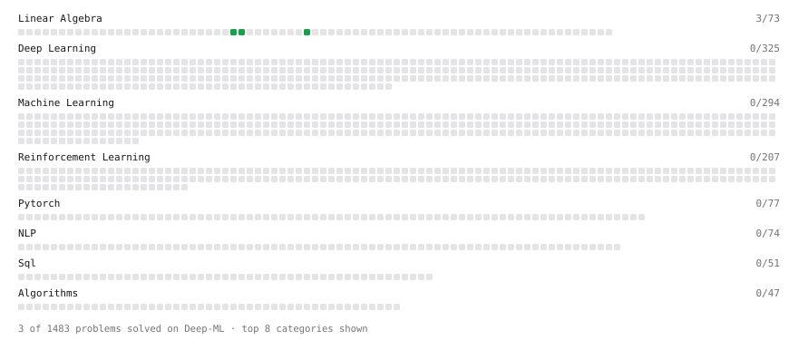

# Deep-ML

My machine learning practice from [Deep-ML](https://www.deep-ml.com). Every solution here was written by hand.

**3** solved · 2 problems · 0 labs · 1 math

[**Browse the interactive portfolio**](https://ishxn-s11.github.io/deep-ml/) to replay this filling in over time.

## Problems

| | Difficulty | Solved | |
| --- | --- | --- | --- |
| [Dot Product Calculator](https://www.deep-ml.com/problems/83) | easy | 2026-09-29 | [solution](problems/0083-dot-product-calculator) |
| [Vector Norms (L1/L2/L-inf) and the Frobenius Norm](https://www.deep-ml.com/problems/328) | easy | 2026-10-01 | [solution](problems/0328-vector-norms-l1-l2-l-inf-and-the-frobenius-norm) |

## Math

| | Difficulty | Solved | |
| --- | --- | --- | --- |
| [Vector Operations](https://www.deep-ml.com/math-problems/7) | easy | 2026-10-01 | [solution](math/0007-vector-operations) |

---

_This file is regenerated by Deep-ML on every push._
